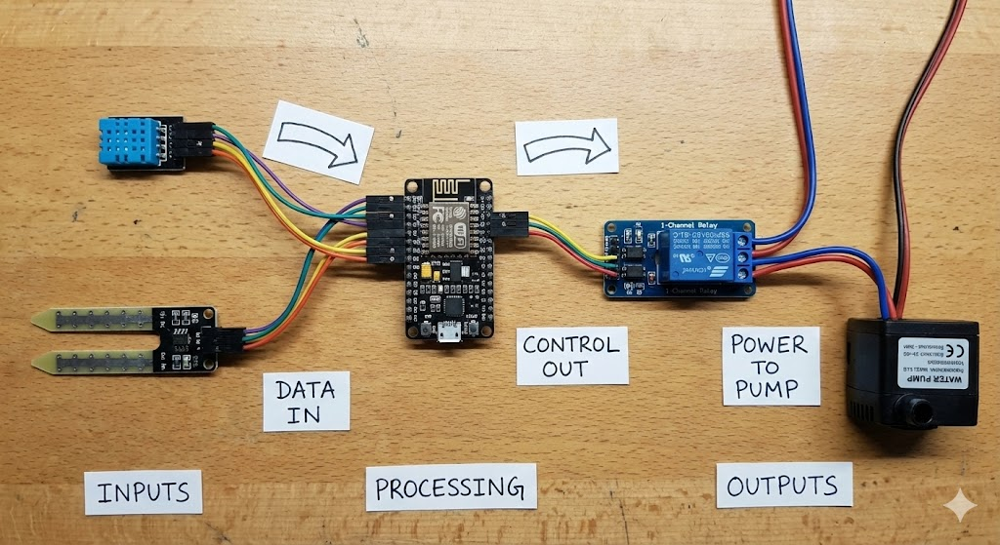
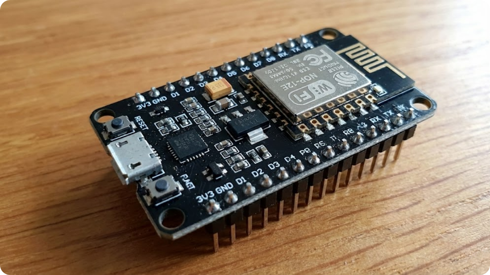
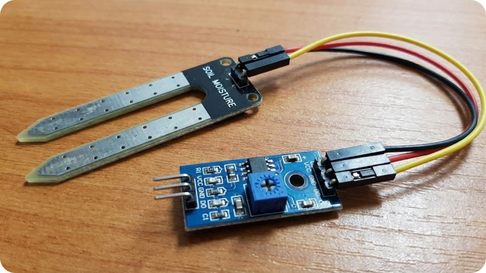
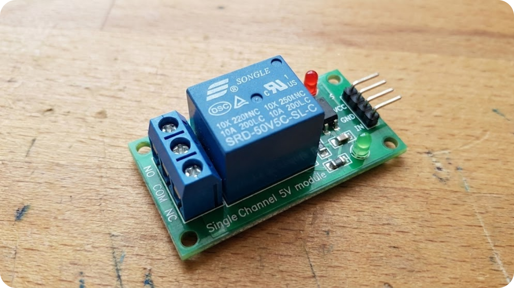
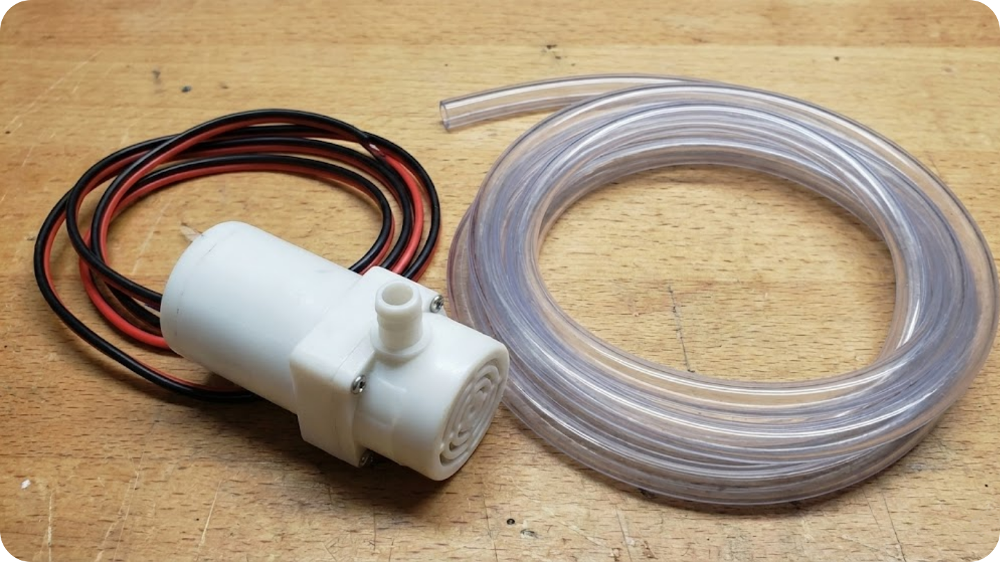
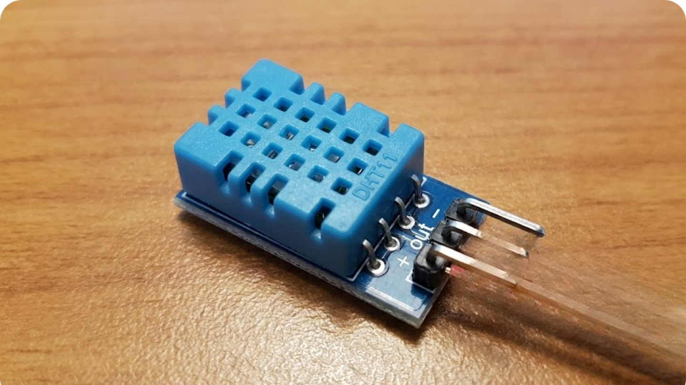

# The Master Plan.

### 1. The Master Plan: How it Works

Before we plug in any wires, we need to understand the logic. Building an automated system is just like teaching a robot how to think.

We can break our entire project down into three simple stages: **Input**, **Processing**, and **Output**.

1. **The Input (The Senses):**
Just like you touch the soil to feel if it's dry, our system uses a **Soil Moisture Sensor**. It constantly checks the ground and sends a signal to the brain. We also use a **DHT11 Sensor** to "feel" the air temperature and humidity.
2. **The Brain (Processing):**
The **ESP8266** is the brain. It reads the signal from the sensors and asks a simple question: *"Is the soil too dry?"*
    - If **YES**: It decides to start the pump.
    - If **NO**: It keeps the pump off and goes back to sleep.
    - *Bonus:* Since the ESP8266 has Wi-Fi, it will also send this data to a **Dashboard** (which we will build later) so you can see your plant's health on your phone!
3. **The Output (The Action):**
The brain cannot power the big pump directly. Instead, it sends a signal to a **Relay**. The Relay acts like a powerful digital switch, turning the **Water Pump** ON to water the plant.

---

### 2. Meet Your Components

Here is a quick introduction to the parts you found in your kit and the role each one plays.

### **1. The Brain: ESP8266 NodeMCU**

This is a powerful microcontroller with built-in Wi-Fi. It is similar to an Arduino but smarter because it can connect to the internet.

- **Role:** Runs your code, reads sensors, controls the pump, and talks to the web.

### **2. The Sense: Soil Moisture Sensor**

This sensor has two large exposed pads that act as a variable resistor. When water is present in the soil, it conducts electricity better.

- **Role:** Tells the ESP8266 if the soil is Wet (conductive) or Dry (resistive).

### **3. The Muscle: Relay Module**

Our ESP8266 operates on 3.3 Volts, but our pump is powerful and needs more energy. The Relay is an electromagnetic switch that bridges this gap.

- **Role:** Allows the small 3.3V signal from the ESP to turn on the high-power circuit for the pump safely.

### **4. The Worker: Mini Water Pump**

A submersible pump that sucks water in and pushes it out through the vinyl tubing.

- **Role:** Physically moves water from your reservoir to the plant.
- *Important:* This pump must always be underwater when running. Running it dry can damage it!

### **5. The Climate Monitor: DHT11**

A blue, grilled sensor that measures the environment.

- **Role:** Reads the air temperature and humidity percentages. This helps us know if the plant is too hot or cold, regardless of the water level.

---

### 3. What We Are Building Today

For this "Getting Started" guide, we will build the **Single-Plant Monitor**.

We will connect:

- **1x** Soil Moisture Sensor
- **1x** DHT11 Sensor
- **1x** Relay & Pump
- **1x** ESP8266

Once you understand how to control one plant, adding the other two sensors for the full "3-Plant System" is as easy as plugging in two more wires!