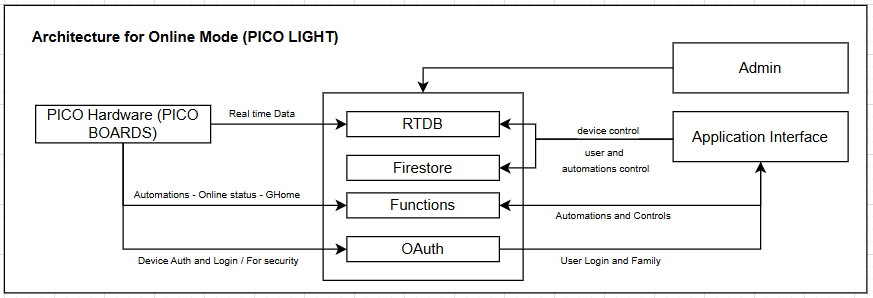

# PICO V1.3 Master Doc

Created: January 6, 2026 5:24 PM
Domain: SOP
Created time: January 6, 2026 5:24 PM
Status: Not started
Tags: MASTER

<aside>
💡

This doc contains Information and Sub-docs Needed for Overall RND of PICO IOT From initial beginning till here with entire Hardware Architecture And idea, App pages and classes, firmware structures and Logics, and entire backend structures.

</aside>

## **PICO IOT Introduction**

PICO IOT is a family of smart controllers that turns existing lights and appliances into intelligent, automated devices. The system combines compact hardware (PICO LIGHT, PICO MOTION, future nodes) with a mobile app and cloud backend to provide remote control, automation, and energy insights.

- It is designed for Indian homes, societies, and small businesses where reliability, low cost
- Our easy installation and necessary use cases matter more than fancy features.

<aside>

**Mission :**  

- Make everyday electrical appliances **intelligent and accessible** so that anyone can save energy and add comfort without needing to be “techie” or redo their wiring.
- Bring automation that works reliably in real Indian conditions: power cuts, poor Wi‑Fi, non‑technical users, and mixed old/new infrastructure.
- Build a product line that scales from a single room to an entire society, keeping setup and maintenance simple at every step.
</aside>

<aside>

**Core Values :**  

- Reliability first: devices must turn on/off correctly every time, survive power/Wi‑Fi issues, and recover automatically.
- Transparency: clear behavior, clear onboarding, and clear feedback.
</aside>

<aside>

**Vision:**

- Create a unified, interoperable PICO ecosystem where lights, fans, sockets, motors, and sensors work together as one **invisible** automation layer over existing buildings.
- Become the default choice for “practical smart automation” in India’s mid‑segment homes, societies, and small commercial spaces, not just luxury villas.
- Evolve from single‑device control to a platform that optimizes energy usage across entire buildings using sensor data and smart scheduling.
</aside>

<aside>

**Product Philosophy:** 

- Start from real use‑cases (remote control for parents, motion for corridors, pump/tank control for societies) and then design hardware, firmware, and app around those flows.
- Keep the “smart” work in firmware and cloud, while the hardware stays as simple, robust, and serviceable as possible.
</aside>

---

### PICO IOT Variants Table

| Variant | **Description** | **Status** | Mode | Notes |
| --- | --- | --- | --- | --- |
| PICO LIGHT | WIFI enabled B22 socket variant designed for Home automations. Connect to current B22 sockets and Make your AC appliences and Lights Smart. | V1.3 In Progress | Online | Working on this Variant since V1.1, V1.2, V1.3 and will work on Node, POWER, SOCKET variants once this is succedd |
| PICO MOTION L | Smart Wifi less Variant Just Made for Motion controlled Lights, Includes B22 Socket. | RND in Progress | Offline | Motion Sensor enabled , this is New RND, Implement for NODE also once worked. |
| PICO NODES (1-5) | Smart MultiNodal Module to control and Automate your House.  | Not Started | Online | Similar to LIGHT but MultiNodes enabled and Need to mount inside Switchboard, and also Physical Logical switch access |
| PICO SOCKET | Smart Socket to add Timers and all other controls | Not started | Online / Offline | Lot to add in it, like small display or something ? so many things in plan for this one |
| PICO POWER | Strong high power Node to control Motor pumps and all | Not started | Online / Offline | Once LIGHT series done will work on all of it with using same architecture from LIGHT |
| PICO SENS | This series have different sensors included … to add extra layer of automation | Not started | Online | This can have different snesors  |

### Versions and Series till now

| Version | Description | Falures and Mistakes |
| --- | --- | --- |
| V1.1 | **Hardware:** ESP-01 based architecture (without octocoupler), AMS1117 with 5V 2A power supply. 
Firmware : Unable to do OTA due to less memory, Merged , and Wifi access
Backend : Simple Firestore based backend, and RTDB based,, No O-auth or user based Logins
App : App was not there, simple web based UI to control without any Auth / User base | 1. Used Unverified pcb architecture, didnt do proper RND for Relay control.
2. Microcontroller selection was not good
3. Firebase architecture was not stable and reliable  |
| V1.2 | Hardware: ESP-12F based, with 3A buck convertor Support, 5V 2A power supply
Firmware: Smoth OTA suppot and  firmware flexibility, Added macros to control different variants
Backend: Added OAuth, Firebase cloud automation layer. also realtime data shifted to RTDB and User / App data to Firestore to efficient reasults.
App: Seemless user experienced App to Login, family control, and Add automations also. | 1. repeated same hardware mistake of not using optoiso, in this version also (Worst mistake ever)
2. App : didn’t give that much attention to app to make it more stable
3. failed to add Google home integrations. |
| V1.3 | New development working on right now. Major focus is fixing hardware, that was messed up last 2 times. and also adding more stabality to system. |  |

---

## Current system Architecture and Flow diagram

Entire system contains of several Key points 

- **Hardware:** Hardware consist of Modem (ESP32 as per V1.2) that acts as gateway with internet and Internal system hardware. Also AC switch (Relay) Controller by Modem, Power supply (To get AC and provide DC stable to Modem and switch control) and some other support circuit for smooth operations and power flow.
- **Firmware**: Firmware system is flexible and specifically designed to shape hardware as needed as possible. add more inputs or change Modes of hardware as per need. for eg. if  for same hardware user wants MOTION only feature with `OTA` we can add that accordingly, just by changing firmware. all we need is stable OTA mechanisms. Read more here : [OTA for PICO IOT DEVICES](https://www.notion.so/OTA-for-PICO-IOT-DEVICES-2e1d078df3e280dea4bfdc62b17be847?pvs=21)
- Backend: Right now backend is simple and all connected in one roof for Google cloud. We are using Firebase Firestore to store all of App user data like user details, Preferences, Family details. Also Firestore is used to store all automations data and Schedules. RTDB (Realtime database)  is being used for live data like Device On Off status controls, feedbacks and also Secondary device details that device needs like OTA updates, WIFI updates, and flags like factory reset / WIFI reset etc. Read more here [Firebase Firestore and RTDB in Detail for V1.2](https://www.notion.so/Firebase-Firestore-and-RTDB-in-Detail-for-V1-2-2e1d078df3e2800c8e1dc81fce2d32fe?pvs=21) 
Then for automations, device alive status and also Google Home integration we are using Firebase Functions. and For user and safe device login using `Google OAuth` system so Databases are open to Device and User only with specific needed accesses.
- App: Current application is Flutter based, right now designed and tested on Android system. Added various features and tried to implement possible UI and UX features. user can 
a. Create account add and change credentials. 
b. add family members so preferences can be user specific. 
c. Home management → Room management → Device management and Control
d. Also can add automations and routines for devices.  more about app → [App Flow and Use cases and issues also](https://www.notion.so/App-Flow-and-Use-cases-and-issues-also-2e1d078df3e280a68dcbe8173fcbae76?pvs=21)
- Admin dashboard: Admin dashboard is designed only for device and version controls. right now entire access is for specific admins only (mentioned directly in rules) for now there are no any levels to admins, but admin can see edit any of the devices and also add new devices to inventory. Note - One can claim device (Connect device under user's account) we need claiming process. it is detailed mentioned here -> [Claiming Process Architecture](https://www.notion.so/Claiming-Process-Architecture-2e1d078df3e2803cb641d9cbd1ffdc15?pvs=21). but other than that : adding new devices to inventory (`That creates device account also in OAuth` with specific device MAC based name and password). Also we can do Mass OTA for firmware, change device and other properties. and See handshake logs and other logs to debug out things for RND. Read more about admin dashboard and future improvement Ideas → [Admin Dashboard Tour and Improvements](https://www.notion.so/Admin-Dashboard-Tour-and-Improvements-2e1d078df3e280f48f2efe2e2d837e68?pvs=21)

---

PICO MOTION Variant is in Progress … will update more things once they are ready to go.

---

## **Hardware design and Guide**

### 1. **Overall hardware architecture (current + previous)**

| Version | Controller used | Other additions | Power Architecture | Issues Faced |
| --- | --- | --- | --- | --- |
| PICO IOT V1.1 | ESP-01 |  | AMS1117 to power up ESP and 5V 2A adapters to power up relay. | 1- Major issue was AMS1117 was not fit with relay causing ESP-resets whenever relay was switching.
2- Other issue was ESP-01 was not capable enough to handle op.  |
| PICO LIGHT V1.2 | ESP-12F |  | 1.5A Mini buck convertor to Power ESP, followed by 5V 2A adapter, provided same 5V source to Relay | 1- Buck with ESP is worst architecture, damaging ESP’s and not keeping supply proper to the point |
| PICO LIGHT V1.3 | ESP-12F | Optoisolator and some sensor Input pins for Physical and fallback switch | Optocoupler to isolate VCC from ESP to relay, so stable AMS1117 Power supply to ESP and 5V adapter (maybe 600ma ) to provide it to relay. | In RND phase. started new |
| PICO MOTION V1.3 | STM-08 | PIR sensor for motion based automation | Optocoupler to isolate VCC from ESP to relay, so stable AMS1117 Power supply to ESP and 5V adapter (maybe 600ma ) to provide it to relay. but in Plan phase | Still in Plan and RND phase |

### **Basic Architecture (Stable)**

Here are some of the PCB Images and Prototypes: 

### 2. **Enclosures, sockets and mechanicals**

- Current enclosure approach (3D‑printed cases)
- Socket types used (B22, wall sockets, screw terminals) and any mechanical quirks.
- **B22 socket dimensions vary between brands/shops**, so `fit must be checked with real samples` before committing to production

### 3. **Wiring and connectors + Manufacturing and assembly notes**

- There are different kind of structures every time, as board and some components changes entire structure and case changes. for now there is no such rigid plan for it but added some images  here so can get rough idea of it.

---

## Backend Architecture

So entire backend for now is totally based on `google Cloud.`

- We are using Firebase RTDB (Realtime database) for Device Live updates - Device on-off status, device Feedback to status. and also device online status. Firmware updates and OTA and some other needed Flags and Variables.
- For App and user preferences and other app data like user family members, Homes and Rooms and all of the device based automations, we are using Firestore database.
- For Time based automations and other Smart automations we are working with Firebase Functions : That includes - Janitor (device online / offline status update), Timer Automation, Sensor Automation, and Google Homograph.

Shared basic Firebase RTDB and Firestore architecture Snapshots.

---

### **Firestore Architecture**

### 1. `users` (Account & Preferences)

- **`email` / `contact`**: Primary identifiers for the user account and communication.
- **`familyMembers`**: An array of profiles (name, avatar, theme) allowing multiple people to control the same home with personalized UI settings.
- **`favoriteNodeIds`**: A list of specific device nodes (e.g., "Bedroom Light") pinned by that family member for quick access.
- **`hapticsEnabled`**: A UI preference toggle for vibration feedback within the mobile app.

---

### 2. `homes` (Physical Structure)

- **`homeId`**: A unique identifier linking a group of devices to a physical location (e.g., "Ngr Home" vs. "HP Pune").
- **`roomOrder`**: A custom-sorted list of room names, defining how they appear in the app's navigation or dashboard.
- **`usageType`**: Categorizes the environment (e.g., "Family" or "Office") to tailor the app experience.

---

### 3. `routines` (Automation Engine)

- **`name`**: The label for the automation, such as "Good night" or "Morning Coffee."
- **`isEnabled`**: A master switch to turn the specific automation routine on or off.
- **`trigger`**: Defines the condition that starts the routine, such as a specific **`time`** (e.g., 23:15) or a sensor event.
- **`actions`**: A list of tasks to execute when triggered, containing:
    - **`type`**: The category of action (e.g., "device_control").
    - **`commands`**: The specific state change to send to the hardware (e.g., `isOn: false`).
    - **`deviceId` / `nodeId`**: Targets the exact physical relay to be toggled.
- **`delayMinutes`**: Allows for "wait" periods between actions in a sequence.

### **Realtime Database Top level architecture and Example**

### `devices` (Live State & Configuration)

- **`isOnline`**: A boolean flag indicating if the device is currently connected to the internet.
- **`Nodes`**: An object containing the current state (`isOn`), custom name, and room assignment for physical relays/outputs.
- **`PIR`**: Settings for the motion sensor, including whether it is enabled and the activation duration in seconds.
- **`firmware`**: A string identifying the specific firmware version currently running on the hardware.
- **`ownerID`**: The unique Firebase UID of the user who has administrative control over the device.

---

### `handshake_logs` (Diagnostics)

- **`resetReason`**: Captures the specific reason for the last reboot, such as "Power On," "Software Restart," or "Exception."
- **`ts`**: A human-readable timestamp of when the device last performed a successful handshake with the server.

---

### `deviceClaims` (Onboarding)

- **`claim`**: A unique 6-character alphanumeric code used to safely link physical hardware to a user's account.
- **`status`**: Tracks the current state of the onboarding process (e.g., "pending" before a user enters the code).
- **`createdAt`**: A Unix timestamp marking when the device was first registered in the inventory.
- **`homeId`**: The identifier for the "Virtual Home" group the device belongs to within the app.

---

### `firmware_versions` (OTA Management)

- **`hw_compat`**: Defines which hardware revision (e.g., ESP-12F V1.2) this specific binary is compatible with.
- **`status`**: Marks the release stage, such as "production" for stable builds or "testing" for internal use.
- **`url`**: The direct download link used by the microcontroller to pull the binary during an OTA update.
- **`tags`**: Short labels (e.g., "STABLE") to help developers quickly identify version milestone

## **Some other Notes and Important Points**

---

### Claiming Process and Connection of User → Device

[Detailed SubDocs](Detailed%20SubDocs%202e0d078df3e280059ab9d9a9dacee3e6.csv)